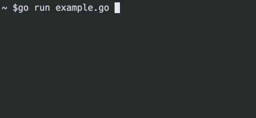

# FlippyText [](https://travis-ci.org/blcksec/flippytext) [](https://coveralls.io/github/blcksec/flippytext?branch=master) [](https://godoc.org/github.com/blcksec/flippytext)

FlippyText is a Go library for printing animated text one character at a time.



## Install

```
go get github.com/blcksec/flippytext
```

## Example 

```go
import "github.com/blcksec/flippytext"

func main() {
		flippytext.New().Write("hello world")
}
```
